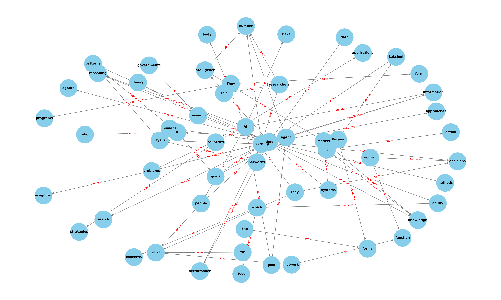

# 🧠 WikiGraph: A Wikipedia-Based Knowledge Graph Builder

A modular pipeline to extract, clean, and visualize knowledge from Wikipedia articles in the form of a **subject-predicate-object** knowledge graph using NLP techniques and Python.

---

## 🚀 Features

- 📄 Automatically fetches articles from Wikipedia  
- 🧹 Cleans and preprocesses the raw text  
- 🧠 Extracts semantic triplets (subject, predicate, object)  
- 🌐 Builds a knowledge graph using NetworkX  
- 🔍 Interactive querying for entity relationships  

---

## 📁 Project Structure

├── main.py # Main pipeline runner
├── extract.py # Extracts raw Wikipedia content
├── clean.py # Cleans and normalizes text
├── triplet_extract.py # Extracts SPO triplets using NLP
├── graph_builder.py # Builds and visualizes the graph
├── query_graph.py # Allows querying the knowledge graph
├── data/
│ ├── raw/ # Raw Wikipedia text files
│ ├── processed/ # Cleaned text files
│ ├── triplets.csv # Extracted SPO triplets
│ └── kg_output.png # Generated knowledge graph image

